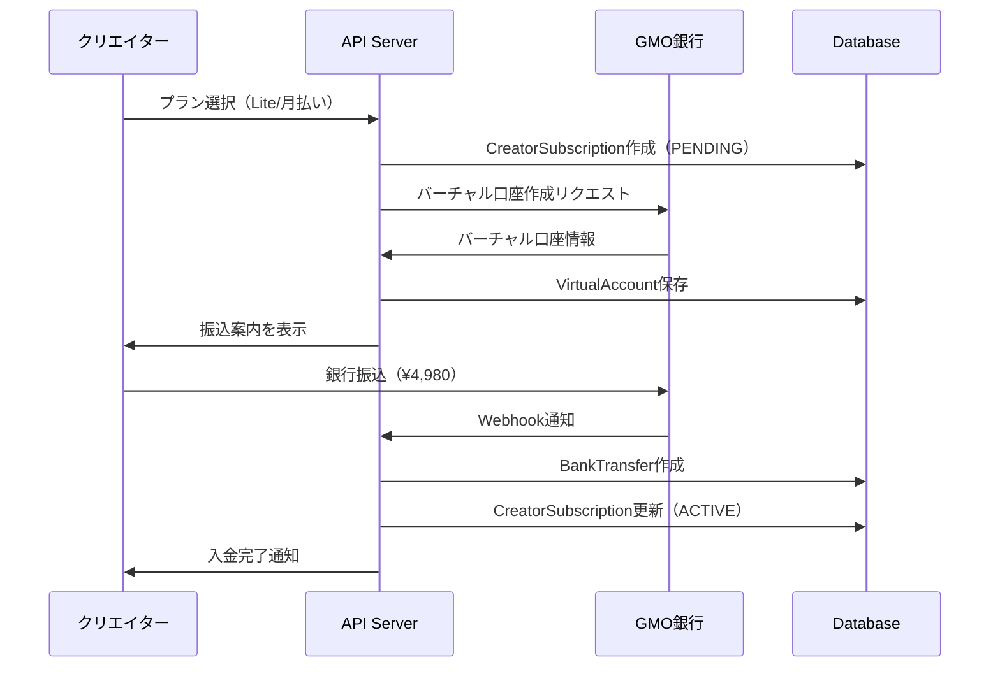
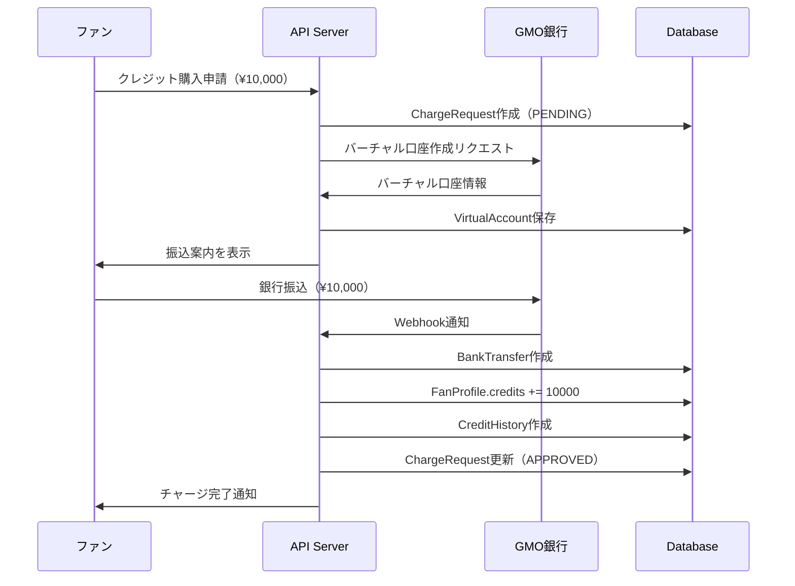

# GMO Bank API Usage Guide

## Overview
GMOあおぞらネット銀行のバーチャル口座を使った自動入金処理システムのAPI使用ガイド。

## API Endpoints

### 1. バーチャル口座管理

#### クリエイター向けバーチャル口座を作成
```bash
POST /virtual-accounts/creator/:creatorId

# Example
curl -X POST http://localhost:3000/virtual-accounts/creator/cm4abc123
```

**Response:**
```json
{
  "id": "va_123",
  "creatorId": "cm4abc123",
  "accountNumber": "1234567890",
  "accountName": "クリエイター名_PLAN",
  "branchCode": "001",
  "purpose": "CREATOR_PLAN",
  "isActive": true,
  "createdAt": "2026-01-30T12:00:00Z"
}
```

#### ファン向けバーチャル口座を作成
```bash
POST /virtual-accounts/fan/:fanId

# Example
curl -X POST http://localhost:3000/virtual-accounts/fan/fp_xyz789
```

**Response:**
```json
{
  "id": "va_456",
  "fanId": "fp_xyz789",
  "accountNumber": "9876543210",
  "accountName": "ファン名_CREDIT",
  "branchCode": "001",
  "purpose": "FAN_CREDIT",
  "isActive": true,
  "createdAt": "2026-01-30T12:00:00Z"
}
```

#### バーチャル口座情報を取得
```bash
GET /virtual-accounts/:accountNumber

# Example
curl http://localhost:3000/virtual-accounts/1234567890
```

#### 振込案内情報を取得
```bash
GET /virtual-accounts/:accountNumber/transfer-instructions

# Example
curl http://localhost:3000/virtual-accounts/1234567890/transfer-instructions
```

**Response:**
```json
{
  "bankName": "GMOあおぞらネット銀行",
  "bankCode": "0310",
  "branchName": "本店",
  "branchCode": "001",
  "accountType": "普通",
  "accountNumber": "1234567890",
  "accountName": "クリエイター名_PLAN",
  "purpose": "CREATOR_PLAN",
  "notes": [
    "振込手数料はお客様負担となります",
    "振込名義人は登録されたお名前と一致する必要があります",
    "入金確認後、自動的に処理されます"
  ]
}
```

#### 取引履歴を取得
```bash
GET /virtual-accounts/:accountNumber/transactions?from=2026-01-01&to=2026-01-31

# Example
curl "http://localhost:3000/virtual-accounts/1234567890/transactions?from=2026-01-01&to=2026-01-31"
```

**Response:**
```json
[
  {
    "id": "bt_001",
    "amount": 4980,
    "transferorName": "ヤマダタロウ",
    "transferDate": "2026-01-30T10:00:00Z",
    "type": "CREATOR_PLAN",
    "status": "PROCESSED",
    "processedAt": "2026-01-30T10:00:05Z",
    "creatorSubscription": {
      "id": "cs_123",
      "status": "ACTIVE"
    }
  }
]
```

#### バーチャル口座を無効化
```bash
POST /virtual-accounts/:accountNumber/deactivate

# Example
curl -X POST http://localhost:3000/virtual-accounts/1234567890/deactivate
```

#### 全てのバーチャル口座を一覧取得（管理者用）
```bash
GET /virtual-accounts?purpose=CREATOR_PLAN&isActive=true

# Example
curl "http://localhost:3000/virtual-accounts?purpose=CREATOR_PLAN&isActive=true"
```

### 2. Webhook処理

#### GMO Webhook受信（GMOから自動的に送信される）
```bash
POST /webhooks/gmo/bank-transfer
Headers:
  X-GMO-Signature: <HMAC署名>
Body:
{
  "transactionId": "GMO_TXN_12345",
  "accountNumber": "1234567890",
  "amount": 4980,
  "transferorName": "ヤマダタロウ",
  "transferDate": "2026-01-30T12:00:00Z"
}
```

#### Webhook テスト（開発環境のみ）
```bash
POST /webhooks/gmo/test
Body:
{
  "transactionId": "TEST_TXN_001",
  "accountNumber": "1234567890",
  "amount": 4980,
  "transferorName": "テストユーザー",
  "transferDate": "2026-01-30T12:00:00Z"
}

# Example
curl -X POST http://localhost:3000/webhooks/gmo/test \
  -H "Content-Type: application/json" \
  -d '{
    "transactionId": "TEST_TXN_001",
    "accountNumber": "1234567890",
    "amount": 4980,
    "transferorName": "テストユーザー",
    "transferDate": "2026-01-30T12:00:00Z"
  }'
```

## Usage Flow

### クリエイター向けプラン支払いフロー



### ファン向けクレジット購入フロー



## Code Examples

### バーチャル口座作成

```typescript
// クリエイター向けバーチャル口座を作成
const virtualAccount = await fetch(
  'http://localhost:3000/virtual-accounts/creator/cm4abc123',
  { method: 'POST' }
).then(res => res.json());

console.log('振込先:', virtualAccount.accountNumber);
```

### 振込案内を取得して表示

```typescript
const instructions = await fetch(
  `http://localhost:3000/virtual-accounts/${accountNumber}/transfer-instructions`
).then(res => res.json());

console.log(`
振込先情報:
銀行名: ${instructions.bankName}
支店名: ${instructions.branchName}
口座種別: ${instructions.accountType}
口座番号: ${instructions.accountNumber}
口座名義: ${instructions.accountName}
`);
```

### 取引履歴を取得

```typescript
const transactions = await fetch(
  `http://localhost:3000/virtual-accounts/${accountNumber}/transactions?from=2026-01-01&to=2026-01-31`
).then(res => res.json());

transactions.forEach(tx => {
  console.log(`${tx.transferDate}: ${tx.transferorName} - ¥${tx.amount}`);
});
```

## Testing

### ローカルでWebhookをテスト

```bash
# 1. サーバーを起動
npm run start:dev

# 2. テストWebhookを送信
curl -X POST http://localhost:3000/webhooks/gmo/test \
  -H "Content-Type: application/json" \
  -d '{
    "transactionId": "TEST_001",
    "accountNumber": "1234567890",
    "amount": 4980,
    "transferorName": "テストユーザー",
    "transferDate": "2026-01-30T12:00:00Z"
  }'

# 3. ログを確認
# Processing GMO webhook: TEST_001
# Virtual account found: 1234567890
# Processing creator plan payment for creator: cm4abc123
# Creator plan activated for creator: cm4abc123
# Successfully processed bank transfer: bt_001
```

### ngrokを使った本番Webhookテスト

```bash
# 1. ngrokでローカルサーバーを公開
ngrok http 3000

# 2. GMO管理画面でWebhook URLを設定
# https://xxxx-xx-xx-xxx-xxx.ngrok.io/webhooks/gmo/bank-transfer

# 3. テスト振込を実行してWebhookを確認
```

## Error Handling

### よくあるエラーと対処法

#### 1. "Virtual account not found"
- バーチャル口座が存在しない、または無効化されている
- 対処: バーチャル口座を作成するか、正しい口座番号を使用

#### 2. "Invalid signature"
- Webhook署名検証に失敗
- 対処: GMO_WEBHOOK_SECRETが正しく設定されているか確認

#### 3. "Creator subscription not found"
- クリエイターのサブスクリプションが存在しない
- 対処: CreatorSubscriptionを事前に作成する必要がある

#### 4. "Payment amount mismatch"
- 振込金額が予定額と異なる
- 対処: プラン料金と振込金額が一致しているか確認

## Monitoring

### 監視すべきメトリクス

1. **Webhook処理成功率**
   - 目標: 99%以上
   - アラート: 95%を下回った場合

2. **平均処理時間**
   - 目標: 5秒以内
   - アラート: 10秒を超えた場合

3. **未処理のBankTransfer**
   - 目標: 0件
   - アラート: 10分以上PENDINGのレコードがある場合

4. **署名検証失敗率**
   - 目標: 0%
   - アラート: 1件でも発生した場合（不正アクセスの可能性）

## Security

### セキュリティベストプラクティス

1. **環境変数の管理**
   - GMO_WEBHOOK_SECRETは絶対に公開しない
   - 定期的にローテーションする

2. **署名検証**
   - 全てのWebhookリクエストで署名を検証
   - タイミング攻撃対策を実装済み

3. **IP制限（オプション）**
   - GMOのWebhook送信元IPをホワイトリスト化
   - ファイアウォールで制限

4. **ログ記録**
   - 全てのWebhook受信をログに記録
   - 不正なリクエストは詳細にログを残す

## Troubleshooting

### デバッグ方法

1. **Webhookが届かない**
   ```bash
   # GMO管理画面でWebhook URLを確認
   # ngrokでローカルサーバーを公開してテスト
   ngrok http 3000
   ```

2. **処理がFAILEDになる**
   ```sql
   -- 失敗したトランザクションを確認
   SELECT * FROM "BankTransfer"
   WHERE status = 'FAILED'
   ORDER BY "createdAt" DESC;

   -- エラーメッセージを確認
   SELECT "errorMessage" FROM "BankTransfer" WHERE id = 'bt_xxx';
   ```

3. **重複処理を防ぐ**
   - `gmoTransactionId`がユニーク制約で保護されている
   - 同じトランザクションIDで複数回Webhookが来ても1回のみ処理

## Next Steps

- [ ] GMO API本番環境への切り替え
- [ ] Webhook再試行ロジックの実装
- [ ] 管理画面の作成（振込履歴、バーチャル口座管理）
- [ ] メール通知の実装（入金完了、プラン有効化）
- [ ] レポート機能の追加（収益レポート、手数料レポート）
