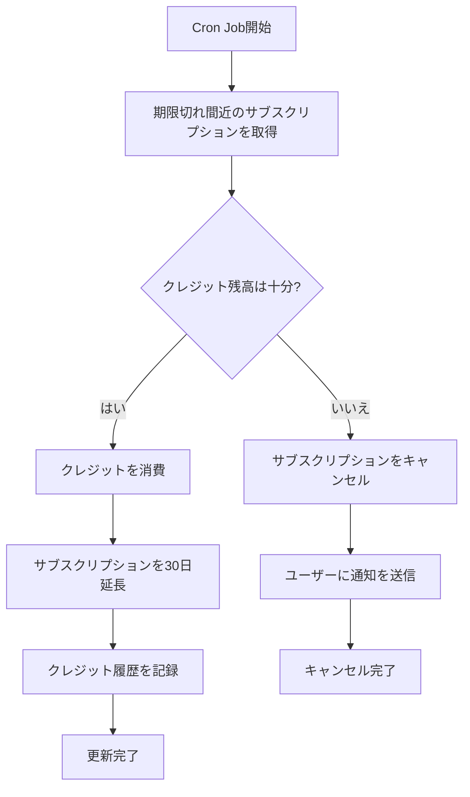

# サブスクリプション自動更新システム

## 概要

このシステムは、クレジットベースのサブスクリプションプランを毎月自動的に更新します。

## 仕組み

1. **登録時**: ユーザーがプランに登録すると、クレジットが消費され、30日間有効なサブスクリプションが作成されます
2. **自動更新**: 毎日午前0時（UTC）に、翌日に期限切れとなるサブスクリプションを自動更新します
3. **クレジット確認**: 更新時にユーザーのクレジット残高を確認し、不足している場合はサブスクリプションをキャンセルします

## セットアップ

### 本番環境（Vercel）

1. Vercel Cron Jobsが自動的に設定されます（`vercel.json`で定義）
2. 環境変数を設定:
   ```bash
   CRON_SECRET=your-random-secret-key-here
   ```
3. デプロイすると自動的に毎日午前0時（UTC）に実行されます

### 開発環境

#### 手動実行

開発環境では、以下のコマンドで手動実行できます:

```bash
# Next.js開発サーバーを起動
npm run dev

# 別のターミナルで実行
npx tsx apps/web/scripts/renew-subscriptions.ts
```

または、直接APIエンドポイントを呼び出す:

```bash
curl -X POST http://localhost:3000/api/cron/renew-subscriptions
```

#### 定期実行（オプション）

Node.jsのcronライブラリを使用して定期実行することも可能です:

```bash
npm install node-cron @types/node-cron
```

`apps/web/cron.ts` を作成:
```typescript
import cron from 'node-cron';

// 毎日午前0時に実行
cron.schedule('0 0 * * *', async () => {
  console.log('Running subscription renewal...');
  await fetch('http://localhost:3000/api/cron/renew-subscriptions', {
    method: 'POST'
  });
});
```

## API エンドポイント

### POST /api/cron/renew-subscriptions

期限切れ間近のサブスクリプションを自動更新します。

**認証**:
- 本番環境: `Authorization: Bearer {CRON_SECRET}` ヘッダーが必要
- 開発環境: 認証不要

**レスポンス**:
```json
{
  "success": true,
  "message": "Subscription renewal completed",
  "results": {
    "total": 10,
    "renewed": 8,
    "cancelled": 2,
    "errors": 0,
    "details": [
      {
        "subscriptionId": "xxx",
        "planName": "プレミアムプラン",
        "status": "renewed",
        "creditsDeducted": 1000
      },
      {
        "subscriptionId": "yyy",
        "planName": "ベーシックプラン",
        "status": "cancelled",
        "reason": "insufficient_credits",
        "requiredCredits": 500,
        "availableCredits": 300
      }
    ]
  }
}
```

## 処理フロー



## データベース構造

### Subscription テーブル
- `status`: ACTIVE, CANCELLED, EXPIRED
- `startDate`: 開始日
- `endDate`: 終了日（30日後）

### CreditHistory テーブル
- `type`: SUBSCRIBE（サブスクリプション）
- `amount`: 消費クレジット（負の値）
- `description`: "プラン名 + プラン更新（自動）"

## 注意事項

1. **タイムゾーン**: Cron Jobは UTC 0:00 に実行されます（日本時間 9:00）
2. **リトライ**: 失敗したサブスクリプションは次の日に再試行されません
3. **通知**: クレジット不足でキャンセルされた場合、現在は通知メールが送信されません（TODO）

## 今後の改善案

- [ ] クレジット不足時の通知メール送信
- [ ] 更新3日前の通知メール送信
- [ ] 更新失敗時のリトライロジック
- [ ] 管理画面でのサブスクリプション管理機能
- [ ] サブスクリプション更新履歴の表示
