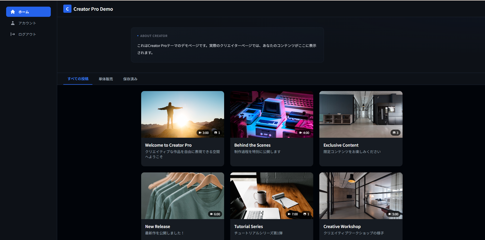

<p align="center">
  
</p>

<h1 align="center">CocoBa</h1>

<p align="center">
  クリエイターが、自分のブランドとドメインで運営できる<br>
  マルチテナント型ファンサイトSaaS
</p>

<p align="center">
  Next.js 14 ・ NestJS 10 ・ TypeScript ・ PostgreSQL ・ Prisma
</p>

## 概要

CocoBaは、クリエイターが既存プラットフォームに依存せず、独自のファンサイトを運営するためのサービスです。

独自ドメイン、デザインテーマ、会員限定コンテンツ、ファンクレジット、売上管理、本人確認、運営管理までを一つのアプリケーションとして実装しています。

## 画面



<p align="center">
  Creator Pro / Neon Pro / Studio Pro / Velvet Pro / Pure Lite / Zine Lite
</p>

## 主な機能

- クリエイターごとのサブドメイン・独自ドメイン
- 6種類のテーマとブランド設定
- 会員プラン・限定コンテンツ・ファン管理
- 銀行振込によるクレジットチャージと入金照合
- 売上分析・本人確認・お問い合わせ管理
- ファン／クリエイター／運営管理者の権限分離

## 技術的なポイント

- Next.js Middlewareによるマルチテナントルーティング
- NextAuthとArgon2による認証
- Prismaで38モデルを管理するドメイン設計
- 仮想口座、Webhook、取引履歴を連携した決済フロー
- Cloudflare R2への画像・動画アップロード
- Next.js、NestJS、共有パッケージによるモノレポ構成

## 技術スタック

| Category | Technology |
| --- | --- |
| Frontend | Next.js / React / TypeScript / Tailwind CSS |
| Backend | NestJS / Next.js Route Handlers |
| Database | PostgreSQL / Prisma |
| Authentication | NextAuth / Google OAuth / Argon2 |
| Storage | Cloudflare R2 / AWS S3 SDK |
| Infrastructure | Docker Compose / PM2 / Nginx |

## 構成

```text
Creator/
├─ apps/web          # Next.js
├─ apps/api          # NestJS
├─ packages/shared   # 共有コード
└─ prisma            # DBスキーマ
```

## ローカル起動

```bash
git clone https://github.com/jaino7/AC.git
cd AC/Creator
docker compose up -d
npm install
npx prisma migrate deploy
```

環境変数を設定後、WebとAPIをそれぞれ起動します。

```bash
npm run dev:web
npm run dev:api
```

- Web: `http://localhost:3000`
- API: `http://localhost:3001`

---

<p align="center">
  <a href="https://github.com/jaino7">GitHub @jaino7</a>
</p>
